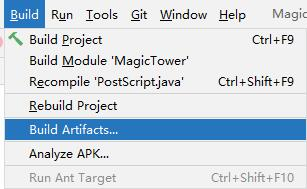

# MagicTower v1.13 (复刻者:Vip、疯子)

## 前言
本项目是基于Java开发的魔塔游戏，复刻的是胖老鼠的flash版魔塔v1.12；同时，我在此基础上添加了彩蛋、分数上传等功能，最终的boss也可以多次击杀以获得更高的分数。

整个魔塔项目包含了一个客户端和一个服务端，其中，本项目为客户端。游戏的主窗体基于JPanel实现，主时间轴为8帧，游戏刷新率默认为每秒50帧；游戏的服务端主要用于玩家分数的上传和展示，主要基于SpringBoot实现。

游戏的主体框架已经搭建完成，其中，提供了比较多的扩展接口，大家可以轻松的在本项目的基础上完成自己的魔塔。

## 参考资料
- [Tower-of-the-Deathmaster](https://github.com/jiminma50/Tower-of-the-Deathmaster)
- [MagicTower](https://github.com/gdut-yy/MagicTower)

## 通关演示视频
视频中的游戏版本较早,但地图设计上没有区别

[【致童年】通关自己复刻的魔塔24层](https://www.bilibili.com/video/BV1PK4y1e7H7)


## 资源列表
- 图片资源
  - Flash魔塔（原版、胖老鼠版、cos105hk版）
  - [Tower-of-the-Deathmaster](https://github.com/jiminma50/Tower-of-the-Deathmaster)的静态资源（通过编写的C#工具类截取）
- 音频资源
  - 游戏音效
    - [Tower-of-the-Deathmaster](https://github.com/jiminma50/Tower-of-the-Deathmaster)的静态资源
    - Flash魔塔（原版、胖老鼠版、cos105hk版）
  - BGM
    - [Tower-of-the-Deathmaster](https://github.com/jiminma50/Tower-of-the-Deathmaster)的静态资源
    - 氷とサンゴのダンジョン 　　　　　　　　　　　  [[風来のシレン外伝 女剣士アスカ見参! (DC) ]](https://music.163.com/#/song?id=1397495802)
    - 廃坑 （断崖の風穴） 　　　　　　　　　　　　　[[風来のシレン2 鬼襲来!シレン城! (N64) ]](https://music.163.com/#/song?id=1397495784)
    - オーバーチュア〜オープニングタイトル　　　　&nbsp;&nbsp;[[Romancing SaGa Original Soundtrack -REMASTER- ]](https://y.qq.com/n/ryqq/albumDetail/000u4Skk1lvxqI)
    - ラストダンジョン　　　　　　　　　　　　　　 &nbsp;[[Romancing SaGa Original Soundtrack -REMASTER- ]](https://y.qq.com/n/ryqq/albumDetail/000u4Skk1lvxqI)
    - 邪神復活 　　　　　　　　　　　　　　　　　　&nbsp;[[Romancing SaGa Original Soundtrack -REMASTER- ]](https://y.qq.com/n/ryqq/albumDetail/000u4Skk1lvxqI)
    - ダンジョン2 　　　　　　　　　　　　　　　　 &nbsp;&nbsp;[[Romancing SaGa Original Soundtrack -REMASTER- ]](https://y.qq.com/n/ryqq/albumDetail/000u4Skk1lvxqI)
    - Dance with wind 　　　　　　　　　　　　　　 &nbsp;&nbsp;&nbsp;[[阿玛迪斯战记 游戏原声带]](https://music.163.com/#/album?id=3233573)

**注：以上的链接仅为能够搜索到的版本，并不代表资源的出处，若有侵权，请联系我删除。**

## 关于作者
不瞒你们说，本人特别喜欢打游戏，也喜欢做一些奇奇怪怪的东西，例如脚本、**等。在校期间也希望完成一个比较有特色的毕业设计，也就有了本项目。限于本人当时水平，代码中存在部分的问题，但基本的游玩完全没有问题，现在开源出来供大家参考、借鉴，同时也欢迎大家向我反馈问题。

[GitHub](https://github.com/xhy1999)　　　[个人主页](http://www.xuehaoyang.com)

****
## 一、开发环境
- 开发工具
  - IntelliJ IDEA 　　2020.1.2
  - JDK 　　　　　 &nbsp;1.8.0_202
- IDEA插件
  - JavaFX Helper 　1.0.4
  - LomBok 　　　 &nbsp;0.32 - 2020.1
- 额外依赖
  - cn.hutool　　　　　　　　　　(工具包)　　　　5.5.1
  - org.projectlombok　　　　　　(LomBok插件)　 1.18.4
  - com.googlecode.soundlibs　　 (音乐播放)　　　1.9.5.4
  - com.alibaba.fastjson　　　　　 (Json解析)　　　1.2.58
  - org.jogamp.jogl　　　　　　　 (Java OpenGL)　 2.3.2
  - org.jogamp.gluegen　　　　　 (Java OpenGL)　 2.3.2

## 二、打包与运行
**注：若想要在开发环境运行，则运行main.Main即可。**

### 1.打包（以IDEA 2021.1为例）

#### (1).点击左上角`File`，选择`Project Structure`


#### (2).点击左侧`Artifacts`，点击中间上方的`+`号，选择`JAR` - `From modules with dependencies`


#### (3).选择主函数：`Main（main）`


#### (4).配置如下，注意红框中的路径，配置完成后点击`OK`


#### (5).点击右下角`Apply`


#### (6).点击IDEA导航栏的`Build`，点击`Build Artifacts`


#### (7).点击弹出小框中的`Rebuild`


#### (8).打包完成


### 2.运行（Windows环境）
直接`双击jar`包，或者在jar包的路径运行指令`java -jar MagicTower.jar`

### 3.运行（Linux环境）
Linux需要有图形化桌面，否则无法运行，运行时在jar包的路径执行指令`java -jar MagicTower.jar`

运行效果如下：


**注意：运行请使用Java 1.8以上环境，Linux请使用Java 1.8_271或以上版本，否则可能导致分数结算界面无法正常弹出。**

## 三、游戏客户端主体设计
以下为游戏的主要设计图（早期版本）


<br><br>

以下为游戏的主要类图（早期版本）


<br><br>

以下为游戏的启动加载图

<br><br>

## 四、游戏客户端主要模块设计
### (1).游戏动画效果与刷新率
**注：此模块参考了[Tower-of-the-Deathmaster](https://github.com/jiminma50/Tower-of-the-Deathmaster)**

Flash可以直接通过时间轴实现动画的效果，但Java不行，因此我在Java窗体绘制类中，增加一个"帧"的概念，即每过一定的时间，将当前的"帧"改变，

例如：
每过125ms将"帧"数加1，那么每秒将会有8"帧"，因此每个实体只要根据"帧"来显示即可。需要注意的是，这里“帧”的概念并不是我们熟悉的FPS(每秒传输帧数)，在这个游戏中，决定FPS的是电脑的性能，但是即使电脑的性能再高，肉眼也只能看到每秒8"帧"的变换。

```java
public void run() {
    TITLE_HEIGHT = (int) (mainframe.getBounds().getSize().getHeight() - this.getSize().getHeight());
    if (TITLE_HEIGHT != 35) {
        mainframe.setSize(WINDOW_WIDTH, WINDOW_HEIGHT - 35 + TITLE_HEIGHT);
    }
    Short fps = 0;
    double fpsTimer = System.currentTimeMillis();
    //每隔100ms进行一次按键判断
    double nsPerTick = 1000000000.0 / 10;
    double then = System.nanoTime();
    double needTick = 0;
    while (running) {
        double now = System.nanoTime();
        needTick += (now - then) / nsPerTick;
        then = now;
        while (needTick >= 1) {
            //进行一次按键判断
            tick();
            needTick--;
        }
        try {
            //在此处控制FPS，sleep20ms，则1s最多刷新50次
            Thread.sleep(20);
        } catch (InterruptedException e) {
            e.printStackTrace();
        }
        //告诉java让其执行绘制方法
        repaint();
        fps++;
        if (System.currentTimeMillis() - fpsTimer > 125) {
            playerPicLabel.setIcon(tower.getPlayer().getPlayerIcon()[1][frames % 4]);
            if (frames == 7) {
                //显示FPS
                showFpsLabel.setText(fps.toString());
                frames = 0;
                fps = 0;
            } else {
                frames++;
            }
            fpsTimer += 125;
        }
    }
    //游戏结束后执行的代码
    end();
}
```

### (2).声音播放
**注：此模块参考了[Java 播放 MP3](https://zhuanlan.zhihu.com/p/100460174)**

JavaSoundAPI原生支持.wav .au .aiff 这些格式的音频文件，当然PCM文件也是可以直接播放的，如果是mp3，ogg，ape，flac则需要第三方jar包。我是通过获取MP3的PCM来播放MP3，这需要导入Google的一个jar包(com.googlecode.soundlibs)。

在初始化类MusicPlayer时，会先声明一个线程池，也就是说大部分的音效将会通过线程池播放。播放详情见类Audio。

### (3).按键监听器
**注：此模块参考了[Tower-of-the-Deathmaster](https://github.com/jiminma50/Tower-of-the-Deathmaster)**

若要实现胖老鼠魔塔或新新魔塔类似的按键监听器，则只要在主绘制类中实现KeyListener接口即可，而我个人比较偏向于间隔一段时间判断按键是否按下，这样可以显得不会太僵硬，因此我实现一个监听类(这个类实现了KeyListener接口)，在主绘制类中实例化，并在主线程中间隔一段时间(100ms)判断某按键是否被按下。

### (4).地图绘制
首先，根据楼层获取tower中此楼层对应的三个图层，循环每一行与每一列，以layer3、layer2、layer1的顺序获取并根据其中保存的id去寻找并绘制实体。

### (5).事件脚本
在与NPC或怪物对话前后往往会有部分判断或事件发生，考虑到这个事件可能会更改实体的属性，于是我将脚本写在了对应的实体类中，
例如在第一次与仙子对话后：
```java
public void script_end(Tower tower) {
  	//判断NPC的id
    if (this.id.equals("npc01_1_1")) {
        //各色钥匙数量+1
        tower.getPlayer().yKey++;
        tower.getPlayer().bKey++;
        tower.getPlayer().rKey++;
        //在左边一格显示新的仙子NPC
        tower.getGameMapList().get(0).layer1[8][4] = "npc01_1_2";
    }
    …
}
```
### (6).特殊楼层与楼层变换
我将普通楼层放在了List中，将特殊楼层放在了Map中，这么做的原因如下：
- 在胖老鼠的魔塔V1.12中，22层会有左右两个分支层，也都为22层，而我为了调整游戏难度，也将在第0层之前加入一个彩蛋层，但是这对于List来说会出现问题：`下标越界`、`特殊层的索引到底是多少`。

因此我会将普通的0-23层存入List中，22层的左右分支和彩蛋层存入特殊楼层中，但是这又会出现神秘楼层传送的问题，因为它不能像普通楼层一样，直接加减楼层索引而实现楼层变换。

解决方法：
首先，在主绘制类中，有两个变量，分别代表普通楼层索引(`floor:int)`和特殊楼层名(`specialGameMapNo:String`)，当玩家在普通楼层时，floor的值为0-23，此时specialGameMapNo的值为null；反之，用户在特殊楼层时，floor的值为-1，specialGameMapNo的值不为null。当主绘制线程绘制游戏地图时，首先判断地图是普通地图还是特殊地图，然后再去对应的实体中获取地图进行绘制。


<br><br>
未完待续...